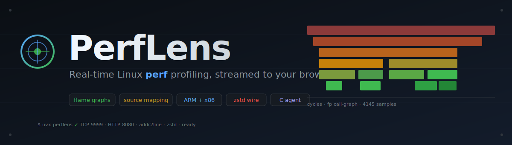
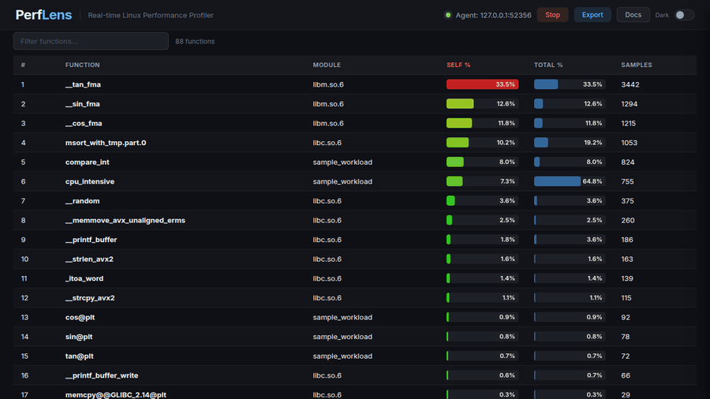
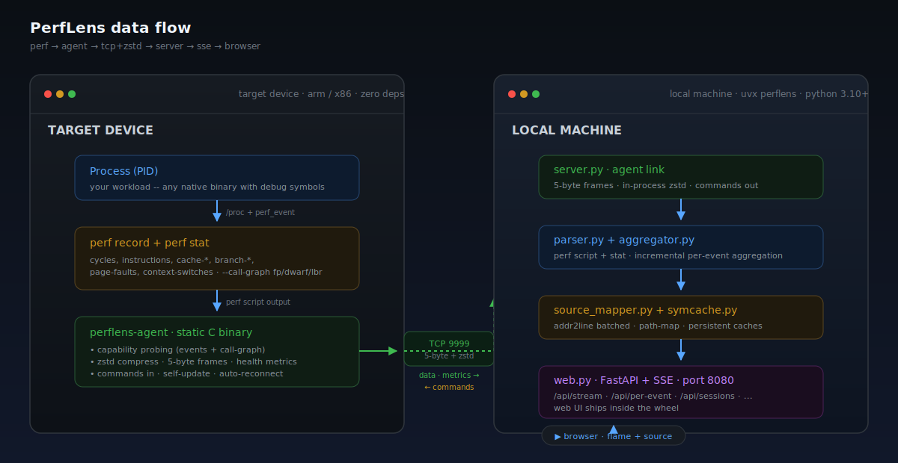
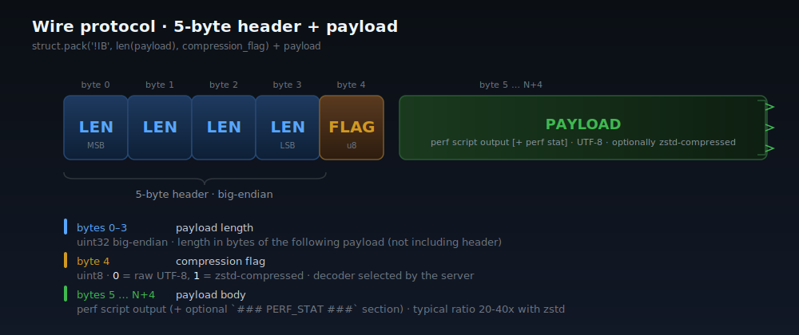

<p align="center">
  
</p>

<p align="center">
  <a href="https://harshithsunku.github.io/perflens/"></a>
  <a href="https://github.com/harshithsunku/perflens/actions/workflows/build.yml"></a>
  <a href="https://pypi.org/project/perflens/"></a>
  <a href="https://github.com/harshithsunku/perflens/releases/latest"></a>
  <a href="https://github.com/harshithsunku/perflens/stargazers"></a>
  <a href="#quick-start"></a>
  
  
  
  
  
</p>

<p align="center">
  <strong>📖 <a href="https://harshithsunku.github.io/perflens/">Read the documentation site →</a></strong><br>
  <sub>Hosted on GitHub Pages — features, architecture deep-dive, CLI &amp; HTTP API reference, live UI tour.</sub>
</p>

<p align="center">
  
  <br><sub><em>Sample counts climb live as <code>perf record</code> rounds stream in. Flip to flame graph, click a function, drop into source with line-level heat. Zero polling — Server-Sent Events.</em></sub>
</p>

# PerfLens

**PerfLens** is a remote Linux performance profiler with a real-time web UI. Drop the agent on any Linux device (ARM or x86), point it at a PID, and watch flame graphs, function tables, `perf stat` metrics, and line-level annotated source update live in your browser.

No frontend frameworks. No Docker. Plain HTML/CSS/JS for the UI, and a single static C agent binary (~2 MB) with zero runtime dependencies — it runs on anything from bare-metal embedded boards to servers, installs with one curl command, and updates itself with `--update`.

---

## Highlights

- **Real-time streaming** — `perf record` runs in ~8s rounds; each round is compressed with zstd and streamed over a 5-byte framed TCP protocol
- **Live web UI** — Server-Sent Events push parsed function tables, flame graphs, and `perf stat` panels to the browser as new data arrives
- **Source-level annotation** — `addr2line` maps samples back to source lines; the UI heat-colors hot lines red/amber/green
- **Per-thread profiling** — filter flame graphs, function tables, and source annotations by thread; dedicated thread analysis view with per-thread CPU breakdown
- **Interactive SVG flame graphs** — vanilla JS, no d3, no bundling; zoomable, hoverable
- **Cross-compilation toolchain support** — `--toolchain-prefix` derives addr2line and readelf from a single prefix; `--sysroot` resolves shared libraries and source files under a sysroot tree
- **ARM + x86** — same agent code runs on aarch64, aarch64_be, armv7l, x86_64
- **Session save / replay** — raw chunks saved to disk, replayed lazily on demand via the UI's session list
- **Static C agent** — single binary with vendored zstd, no runtime dependencies; cross-compiles to aarch64, aarch64_be, armv7l, armeb, x86_64; one-line curl install and built-in self-update
- **Zero-friction server install** — `uvx perflens` (or `pipx` / `pip install --user`); everything resolves user-space, no sudo, corporate-machine friendly. Missing binutils? `perflens provision` downloads static addr2line/readelf into `~/.perflens/bin`
- **Capability probing** — the agent discovers which perf events and call-graph modes (`fp` / `dwarf` / `lbr`) actually work on the target before collecting
- **Zstd compression** — typical perf script payloads compress 20–40× before hitting the wire

---

## Architecture

<p align="center">
  
</p>

The pipeline in one sentence: **`perf record` → agent → TCP+zstd → server → parser → source mapper → SSE → browser.**

### Target device

- The agent probes the kernel's `perf_event_paranoid`, enumerates candidate events (`cycles`, `instructions`, `cache-*`, `branch-*`, `page-faults`, `context-switches`, `cpu-migrations`), tries call-graph modes in order (`fp`, `dwarf`, `lbr`), and picks the first that produces non-empty stacks
- Each collection round runs `perf record` and `perf stat` in parallel for N seconds, then `perf script` to flatten the output
- The combined text is compressed with in-process zstd (level 1) and framed with a 5-byte header
- Reconnects with exponential backoff if the server drops
- Single static binary — **no Python, no libc, no zstd needed on the target**. Suitable for old or minimal ARM/x86 Linux devices.

### Local machine

- `perflens serve` runs a FastAPI/uvicorn HTTP layer (`web.py`) in front of a plain-threads agent side (`server.py`: TCP listener, recv loops, aggregation worker); one agent at a time, any number of SSE browser clients
- `parser.py` parses `perf script` and `perf stat` text into per-event sample lists; `aggregator.py` folds each new chunk incrementally into function summaries and flame graph trees (O(new samples) per chunk, not O(total))
- `source_mapper.py` pipelines addresses through `addr2line` in batches of 500, applies compile-time path prefix rewrites, and builds annotated source views; `symcache.py` persists resolutions and source-file indexes under `~/.perflens/cache` so warm restarts skip the work
- A single `SourceMapper` is created at startup and shared across requests — no per-request forking
- Sessions are spooled to disk as compressed chunks while streaming and replayed lazily on demand (with a config-keyed replay cache) when the user opens them from the UI

---

## Wire protocol

<p align="center">
  
</p>

Every message is a 5-byte header followed by a payload of exactly `LEN` bytes:

```python
header = struct.pack('!IB', len(payload), compression_flag)
sock.sendall(header + payload)
```

| Field | Size | Meaning |
|-------|------|---------|
| `LEN` | 4 bytes (uint32, big-endian) | Payload length in bytes |
| `FLAG` | 1 byte (uint8) | Frame type (see below) |
| `PAYLOAD` | `LEN` bytes | Perf data, JSON command/response, or JSON metrics |

The protocol is bidirectional — data and health metrics flow agent → server, commands flow server → agent over the same socket:

| Flag | Direction | Payload |
|------|-----------|---------|
| `0` | agent → server | Raw `perf script` text, optionally followed by a `### PERF_STAT ###` section |
| `1` | agent → server | Same, zstd-compressed |
| `2` | server → agent | Command request (JSON: `start`, `stop`, `pause`, `resume`, `configure`, ...) |
| `3` | agent → server | Command response / `hello` handshake (JSON) |
| `4` | agent → server | Device health metrics (JSON, every 2s: CPU, memory, temperature, per-process stats) |

The server reads the 5 header bytes first, then exactly `LEN` more. Compression is in-process zstd on both ends (vendored in the agent, the `zstandard` package on the server, external `zstd` binary as a fallback). Typical ratio on real `perf script` output is **20–40×**.

---

## Quick Start

### Option A — install with uv/pip (recommended)

```bash
# On the machine where you want to view profiles (Python 3.10+, no sudo):
uvx perflens serve \
    --source-dir /path/to/sources \
    --binary     /path/to/unstripped-binary
# → http://localhost:8080

# Equivalent alternatives:
#   pipx install perflens          then: perflens serve ...
#   pip install --user perflens    then: perflens serve ...
```

```bash
# On the target Linux device — one-line install (no sudo, ~/.perflens/bin):
curl -fsSL https://raw.githubusercontent.com/harshithsunku/perflens/master/install-agent.sh | sh

# Option 1: agent connects to server
~/.perflens/bin/perflens-agent --server <server-ip>

# Option 2: agent listens, server connects to agent
~/.perflens/bin/perflens-agent --listen
# Then use the Live Debug wizard in the UI to connect to <device-ip>:9999

# Update later (downloads, verifies, atomically replaces itself):
~/.perflens/bin/perflens-agent --update

# Or push the agent to the device from your machine (ssh arch-detect):
perflens push-agent user@device
```

Release assets published on every tagged release:

| Asset | What it is |
|-------|------------|
| `perflens-<ver>-py3-none-any.whl` | Server — Python wheel (`uvx --from ...`) |
| `perflens-agent-linux-x86_64` | Agent — static binary, Linux x86_64 |
| `perflens-agent-linux-aarch64` | Agent — static binary, Linux aarch64 |
| `perflens-agent-linux-aarch64_be` | Agent — static binary, Linux aarch64 BE |
| `perflens-agent-linux-armv7l` | Agent — static binary, Linux armv7l |
| `perflens-agent-linux-armeb` | Agent — static binary, Linux armv7 BE |
| `perflens-tools-linux-{x86_64,aarch64}.tar.gz` | Static addr2line+readelf for `perflens provision` |

### Option B — build the agent yourself

```bash
# Build (on your build machine)
cd agent-c
make                                    # native x86_64
make CROSS=aarch64-linux-gnu-           # ARM64 little-endian
make CROSS=aarch64_be-linux-musl-       # ARM64 big-endian
make CROSS=arm-linux-gnueabihf-         # ARMv7 little-endian
make CROSS=armeb-linux-musleabihf-      # ARMv7 big-endian

# Deploy (single file, no dependencies)
scp perflens-agent user@device:/tmp/
ssh user@device
/tmp/perflens-agent --server <server-ip>        # connects to server
/tmp/perflens-agent --listen                     # or: wait for server to connect in
```

The agent is a single static binary (~2 MB) with zstd built in.

### Option C — from source (dev / contributors)

```bash
# Server (editable install pulls fastapi/uvicorn/orjson/zstandard)
uv venv && uv pip install -e .
.venv/bin/perflens serve \
    --source-dir /path/to/source \
    --binary     /path/to/myprogram \
    --port       9999 \
    --http-port  8080

# Agent (on the target device — build once, copy the binary)
cd agent-c && make && scp perflens-agent user@device:/tmp/
ssh user@device
/tmp/perflens-agent --server <server-ip>   # connects to server
/tmp/perflens-agent --listen                # or: wait for server
```

Then browse to `http://<server-ip>:8080`.

### Prerequisites

| Component | Needs |
|-----------|-------|
| **Target device** | Linux and `perf` — nothing else (the static agent has zstd built in) |
| **Local machine** | Python 3.10+ and `uv`/`pip`. `addr2line`/`readelf` from binutils for source mapping — if missing, `perflens provision` downloads static builds into `~/.perflens/bin` (no sudo). For cross-compiled targets: a matching toolchain with `<prefix>addr2line` and `<prefix>readelf` |
| **Binary** | Compiled with `-g` (debug symbols), not stripped |
| **Source** | A checkout of the source tree readable from the server machine |

---

## Configuration

### Server CLI

| Option | Default | Description |
|---|---|---|
| `--port PORT` | `9999` | TCP port the agent connects to |
| `--http-port PORT` | `8080` | HTTP port for the web UI |
| `--source-dir DIR` | `.` | Root of the source tree for line annotation |
| `--binary PATH` | — | Unstripped binary (enables `addr2line`) |
| `--map PATH` | — | GNU ld linker map file (optional symbol fallback) |
| `--path-map FROM=TO` | — | Rewrite compile-time paths to local paths (e.g. `/build/src=/home/user/src`) |
| `--addr2line PATH` | — | Custom `addr2line` binary (overrides `bin/` and PATH) |
| `--readelf PATH` | — | Custom `readelf` binary |
| `--toolchain-prefix PREFIX` | — | Cross-compilation prefix (e.g. `arm-linux-gnueabihf-`); derives addr2line and readelf |
| `--sysroot DIR` | — | Sysroot for resolving shared library modules and source files |
| `--max-samples N` | `500000` | Raw-sample ring buffer cap (aggregates always cover the full session) |
| `--sessions-dir DIR` | `~/.perflens/sessions` | Where saved sessions are stored (`PERFLENS_HOME` moves the whole `~/.perflens` root) |
| `--http-bind ADDR` | `127.0.0.1` | Web UI bind address (`0.0.0.0` to expose — the UI has no auth) |
| `--browse-root DIR` | `~` | Directory the wizard's file picker is confined to |
| `--token SECRET` | — | Shared secret agents must present (or `PERFLENS_TOKEN`) |
| `--inline` / `--no-inline` | on | Enable/disable inline function resolution via `addr2line -i` |
| `--import FILE` | — | Import a `perf.data` file at startup and make it available as a session |

### Agent CLI

Three run modes (must pick one):

| Mode | Description |
|---|---|
| `--listen` | Daemon: bind `--port`, wait for server to connect in |
| `--server HOST` | Daemon: connect out to server (reconnects with exponential backoff) |
| `--output FILE` | Headless: collect once, write to file (`-` for stdout). Requires `--pid`. |

Options:

| Option | Default | Description |
|---|---|---|
| `--pid PID` | — | PID of process to profile (required for `--output`; set via UI wizard in daemon modes) |
| `--port PORT` | `9999` | TCP port (listen or connect) |
| `--frequency HZ` | `99` | `perf record -F` sampling frequency |
| `--duration SECS` | `8` | Length of each collection round |
| `--rounds N` | `1` | Number of collection rounds (`--output` mode only) |
| `--token SECRET` | — | Shared secret sent to the server in the hello (or `PERFLENS_TOKEN`) |
| `--update` | — | Self-update from the latest GitHub release, then exit |
| `--version` | — | Print version and exit |

---

## HTTP API

| Endpoint | Method | Description |
|----------|--------|-------------|
| `/api/status` | GET | Server + agent connection state, sample totals |
| `/api/stream` | GET | Server-Sent Events: `status`, `agent_connected`, `event_types`, `data_version` (per chunk), `perf_stat`, `metrics_<type>` |
| `/api/per-event?event=<evt>` | GET | Cached per-event snapshot (gzip); clients fetch it when SSE `data_version` bumps |
| `/api/sessions` | GET | List saved sessions (metadata only) |
| `/api/sessions/<id>` | GET | Lazy-replay a session (parses raw chunks on demand, cached) |
| `/api/export/session/<id>?format=` | GET | Export a session: `collapsed` (FlameGraph stacks) or `json` |
| `/api/export/flamegraph?event=&session=` | GET | Standalone SVG flame graph |
| `/api/source?file=<path>&event=<evt>&tid=<tid>` | GET | Annotated source for a single file (optionally filtered by thread) |
| `/api/thread-view?event=<evt>&tid=<tid>` | GET | Per-thread flamegraph and function summary |
| `/api/thread-summary?event=<evt>` | GET | Thread overview: all threads with sample counts and top functions |
| `/api/index/status` | GET | Source-index / DWARF file-list state (truncated preview) |
| `/api/index/files?offset=&limit=&q=` | GET | Paginated DWARF source-file list |
| `/api/metrics/current` | GET | Latest device health metrics per type |
| `/api/metrics/history?type=&start=` | GET | Health metrics time series |
| `/api/connect` | POST | Connect out to a `--listen` agent (`{"host": ..., "port": ...}`) |
| `/api/agent/command` | POST | Send a command to the connected agent (`start`, `stop`, `pause`, ...) |
| `/api/wizard/state` | GET/POST | Persisted Live Debug wizard state |
| `/api/browse?path=` | GET | File picker listing (confined to `--browse-root`) |
| `/api/config/binary` | POST | Set the unstripped binary at runtime |
| `/api/config/source` | POST | Set the source directory at runtime |
| `/api/config/pathmap` | POST | Set compile-time path rewrites at runtime |
| `/api/config/toolchain` | POST | Set toolchain prefix and sysroot at runtime |
| `/api/import` | POST | Import an uploaded `perf.data` file as a session (needs `perf` on the server) |
| `/api/stop` | GET | Disconnect the active agent (triggers normal session save) |
| `/*` | GET | Static files from `ui/` |

---

## Supported perf events

| Event | Typical use | Mode |
|-------|-------------|------|
| `cycles` | CPU time / hot paths | record + stat |
| `instructions` | IPC, retired instruction count | record + stat |
| `cache-misses` | Last-level cache misses | record + stat |
| `cache-references` | LLC accesses | record + stat |
| `branch-misses` | Branch prediction misses | record + stat |
| `branch-instructions` | Total branches | record + stat |
| `page-faults` | Minor/major page faults | stat only |
| `context-switches` | Scheduling pressure | stat only |
| `cpu-migrations` | Inter-CPU movement | stat only |

The agent probes each event before use and only emits the ones the kernel actually supports.

---

## Building release packages

```bash
./build_package.sh              # server wheel/sdist + native C agent
./build_package.sh --server     # Python wheel + sdist only
./build_package.sh --agent-c    # C agent only (native static binary)
```

Output lands in `dist/`:

```
dist/
├── perflens-<ver>-py3-none-any.whl     # server (uvx / pipx / pip)
├── perflens-<ver>.tar.gz               # server sdist
├── perflens-agent-c-<ver>.tar.gz       # agent tarball
└── perflens-agent-linux-<arch>         # agent raw binary (stable name)
```

### CI

[`.github/workflows/test.yml`](.github/workflows/test.yml) runs the pytest suite on Python 3.10–3.13 (parser, aggregator differentials against device-captured fixtures, source mapper, HTTP API, provisioning against a fake release server, and the C-agent wire protocol driven through a fake framing server with a `perf` shim), plus a puppeteer browser E2E that replays a fixture session through the real UI (`node tests/e2e_ui.mjs`, self-contained).

[`.github/workflows/build.yml`](.github/workflows/build.yml) lints (`ruff`), runs the pytest suite, builds and smoke-runs the Python wheel (with a wheel-contents check), builds the static C agent for five architectures (x86_64, aarch64, aarch64_be, armv7l, armeb), and builds static addr2line/readelf tools bundles (x86_64, aarch64) for `perflens provision`. Big-endian agent targets use musl toolchains from musl.cc since Ubuntu only ships little-endian sysroots. Tagged pushes (`v*`) create a GitHub Release and attach all artifacts — including raw `perflens-agent-linux-<arch>` binaries with stable names that `install-agent.sh` and the agent's `--update` fetch from `releases/latest/download/`. Tagged pushes also publish the package to [PyPI](https://pypi.org/project/perflens/) via Trusted Publishing (OIDC — no stored tokens).

---

## Project layout

```
perflens/
├── install-agent.sh              # curl-able agent installer (arch detect, no sudo)
├── agent-c/
│   ├── perflens_agent.c          # C agent (~3200 lines, static binary, zero deps)
│   ├── Makefile                  # native + cross-compile targets
│   └── vendor/zstd/              # vendored zstd amalgamation
├── pyproject.toml                # pip/uv package (console script: perflens)
├── src/perflens/                 # the server package
│   ├── server.py                 # agent TCP protocol + state + sessions
│   ├── web.py                    # FastAPI/uvicorn HTTP layer + SSE hub
│   ├── cli.py                    # perflens serve/import/push-agent/provision
│   ├── parser.py                 # perf script / perf stat parser
│   ├── aggregator.py             # incremental per-event aggregation
│   ├── source_mapper.py          # addr2line pipeline + path remap
│   ├── symcache.py               # persistent caches (~/.perflens/cache)
│   ├── provision.py              # user-space static-tools download
│   └── ui/                       # single-page app (ships in the wheel)
│       ├── index.html
│       ├── app.js                # all UI logic (vanilla JS)
│       └── style.css             # dark + light themes
├── docs/
│   ├── hero.svg
│   ├── architecture.svg
│   └── wire-protocol.svg
├── tests/
│   ├── conftest.py               # shared fixtures (device-captured sessions)
│   ├── test_*.py                 # pytest suite (parser, aggregator, HTTP, agent, ...)
│   ├── e2e_ui.mjs                # puppeteer browser E2E (self-contained)
│   ├── fixtures/                 # gzipped perf sessions from real devices
│   ├── sample_workload.c         # multi-function test program
│   └── Makefile                  # gcc -g -O0 -lm
├── build_package.sh              # local wheel + agent builds
├── .github/workflows/test.yml    # pytest matrix + browser e2e
├── .github/workflows/build.yml   # lint + test + wheel + agents + release
├── VERSION
├── LICENSE (MIT)
└── README.md (this file)
```

---

## Troubleshooting

**`perf_event_paranoid` too high.** The agent warns at startup if `/proc/sys/kernel/perf_event_paranoid > 1` and the UI may show limited events.

```bash
sudo sysctl -w kernel.perf_event_paranoid=1
```

**No function names.** Compile with `-g` and do not strip. `file ./myprogram` should say `not stripped` and `with debug_info`.

**No source line mapping.** Double-check `--binary` points at the exact unstripped binary running on the target and `--source-dir` contains the source files. Use `--path-map /build/src=/home/me/src` when your build was done under a different root.

**Agent can't connect.** The server must be reachable on `--port`. Check with `nc -zv <server-ip> 9999`.

**LXC / container: `perf record -p <pid>` is empty.** Some container environments strip the perf capability set. A system-wide `perf record -a` usually works; the agent's `-p <pid>` mode does not.

**Call-graph probing hangs / slow startup.** Call-graph probing tests `fp`, `dwarf`, then `lbr` in sequence — this adds ~6–12 seconds on first connection. Normal.

---

## Design rules

These are the rules the project is built to:

- **Simplicity first** — a small, deliberate server stack (fastapi/uvicorn/orjson/zstandard, all user-space via uv); plain HTML/JS/CSS, no bundler, no npm; the agent stays zero-dependency static C
- **Defensive parsing** — `perf` output format varies across kernel versions; parser is forgiving
- **No secrets in code** — generic and open-source-friendly
- **No over-engineering** — if it doesn't earn its complexity, it gets cut

See [`CLAUDE.md`](CLAUDE.md) for the full internal reference, or the [documentation site](https://harshithsunku.github.io/perflens/) for the polished version.

---

## License

MIT. See [`LICENSE`](LICENSE).
